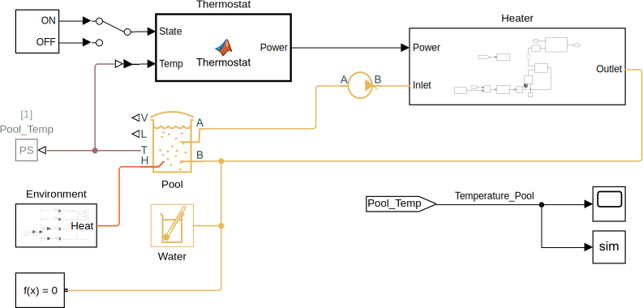

# SwimmingPoolSimulation
> Three domain simulation of a swimming pool created in Simscape as part of the FHNW module glaL4

## Running the Simulation

To start the simulation just run the [`SwimmingPoolSimulation.m`](SwimmingPoolSimulation.m) MATLAB file. This will open and run the Simscape model with the set parameters. The simulation results are exported to the MATLAB workspace and various plots are shown.

### MATLAB Version

This simulation was created in MATLAB and Simulink (Simscape) *R2018b*.

## Results

The following figure shows the heat flow (in W) of the various environmental influences as a function of time (in s). A positive heat flow corresponds to heat flowing into the pool, while a negative heat flow corresponds to heat flowing out of the pool.

 as a function of time (in s)")

All the other results can be found in the [report](doc/SwimmingPoolSimulation_Fankhauser_Canzani_Mueller.pdf "Swimming Pool Simulation Report") (written in German).

## Authors

* Dominik Müller ([@MuellerDominik](https://github.com/MuellerDominik "Dominik Müller"))
* Nico Canzani ([@nicoca20](https://github.com/nicoca20 "Nico Canzani"))
* Pascal Fankhauser ([@PascalFankhauser](https://github.com/PascalFankhauser "@PascalFankhauser"))

## License

Copyright &copy; 2019 Dominik Müller and Nico Canzani and Pascal Fankhauser

This project is licensed under the MIT License - see the [LICENSE](LICENSE "LICENSE") file for details
